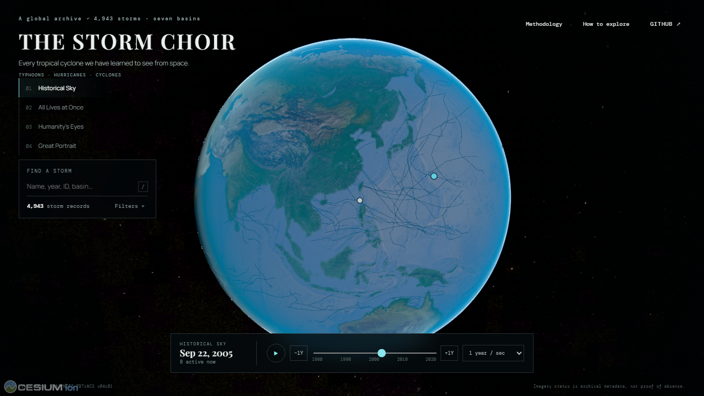

# The Storm Choir

> Every tropical cyclone we have learned to see from space.

**[Open the live archive](https://amyleesterling.github.io/hurricane/)**

The Storm Choir is a cinematic, scientific 3D atlas of tropical cyclone lives across the satellite era. Rotate Earth, move through historical time, synchronize storms by lifecycle, inspect how the observational record changed, and open each cyclone as a living historical specimen.



> The current release is a working exploration prototype using the complete since-1980 IBTrACS global cyclone collection and a growing set of processed satellite imagery. The long-term goal is to assemble the broadest feasible public visual archive of tropical cyclones observed from space.

## Current release

- Token-free CesiumJS globe with self-hosted Natural Earth II base imagery
- 4,943 real IBTrACS v04r01 tropical-cyclone records across seven basins, including Western Pacific typhoons and Indian/Southern Hemisphere cyclones
- Compact overview tracks on first load with full-resolution observations fetched only for active or selected storms
- Historical Sky, All Lives at Once, Humanity's Eyes, and virtualized Great Portrait modes
- UTC playback, lifecycle scrubbing, filtering, search, selection, details, and shareable URL state
- One reviewed authentic NOAA HURSAT-B1 Rita sequence (three infrared frames), plus honest five-state imagery metadata
- Responsive layouts, keyboard-operable controls, focus treatment, and reduced-motion support
- Static GitHub Pages deployment with CI, unit tests, data validation, and Playwright smoke coverage

The first release bundles one reviewed authentic HURSAT-B1 sequence for Rita (2005): three infrared-window frames centered on peak intensity. Every other imagery status remains `uncertain` or `outside-current-collection` until a source file is downloaded, rendered, reviewed, and registered. The interface never claims otherwise.

## Develop

```bash
npm install
npm run dev
npm run lint
npm run typecheck
npm test
npm run build
npm run preview
npx playwright install chromium
npm run test:e2e
```

The production base is `/hurricane/`. `VITE_CESIUM_ION_TOKEN` is optional; the default experience has no paid-service dependency.

## Refresh the track sample

```bash
python -m venv .venv
# Windows: .venv\Scripts\activate
# macOS/Linux: source .venv/bin/activate
pip install -r pipeline/requirements.txt
python pipeline/download_ibtracs.py
python pipeline/normalize_ibtracs.py
python pipeline/validate_dataset.py
```

The raw CSV is cached outside Git. Its official URL, access time, version, and SHA-256 checksum are recorded beside the download. The committed output is deterministic and browser-ready.

For a reviewed HURSAT sample:

```bash
python pipeline/download_hursat.py OFFICIAL_FILE_URL --output pipeline/cache/hursat/sample.nc
python pipeline/inspect_hursat.py pipeline/cache/hursat/sample.nc
python pipeline/render_hursat_frames.py pipeline/cache/hursat/sample.nc --variable IRWIN --output public/data/imagery/sample.png
python pipeline/register_sample_imagery.py
```

## Architecture

React owns controls and application state; an imperative Cesium adapter owns scene primitives and camera behavior. Manifest metadata loads first, then compact track assets. Data processing is offline Python; deployment is entirely static. See [architecture](docs/architecture.md), [data sources](docs/data-sources.md), [imagery methodology](docs/imagery-methodology.md), [scientific caveats](docs/scientific-caveats.md), and [roadmap](docs/roadmap.md).

## Sources and attribution

Track data: NOAA/NCEI [IBTrACS v04r01](https://www.ncei.noaa.gov/products/international-best-track-archive). Imagery framework: NOAA/NCEI [HURSAT-B1 v06](https://www.ncei.noaa.gov/products/hurricane-satellite-data). Rendering: [CesiumJS](https://cesium.com/platform/cesiumjs/) and its bundled Natural Earth II texture. Scientific data remain subject to source-provider terms; the project makes no unsupported claim that downloaded data are relicensed by this repository.

Original project code is MIT licensed. Contributions are welcome through issues and focused pull requests; generated data changes must pass `pipeline/validate_dataset.py` and preserve provenance.
